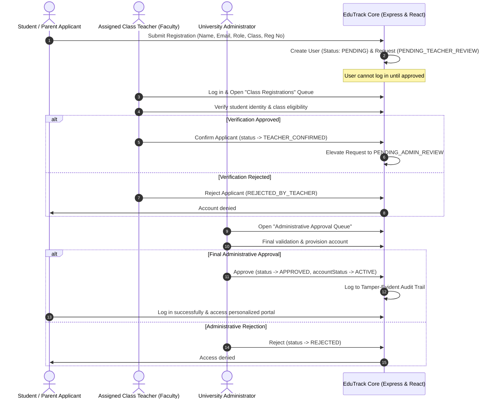
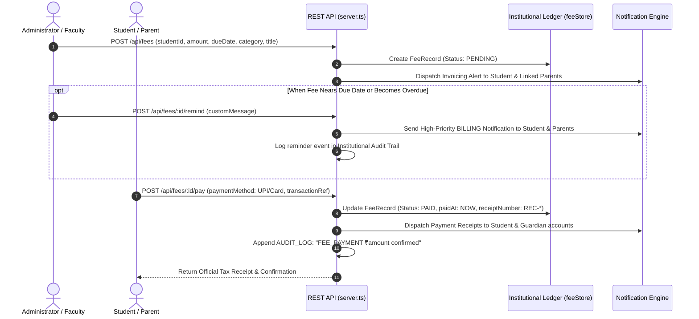
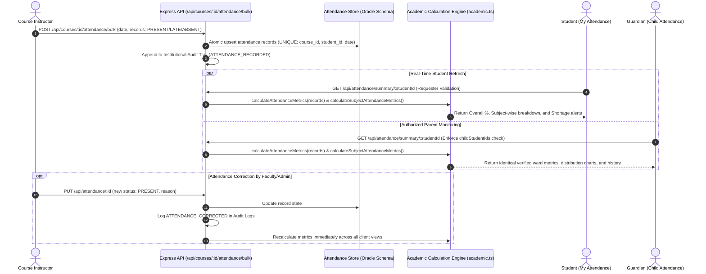
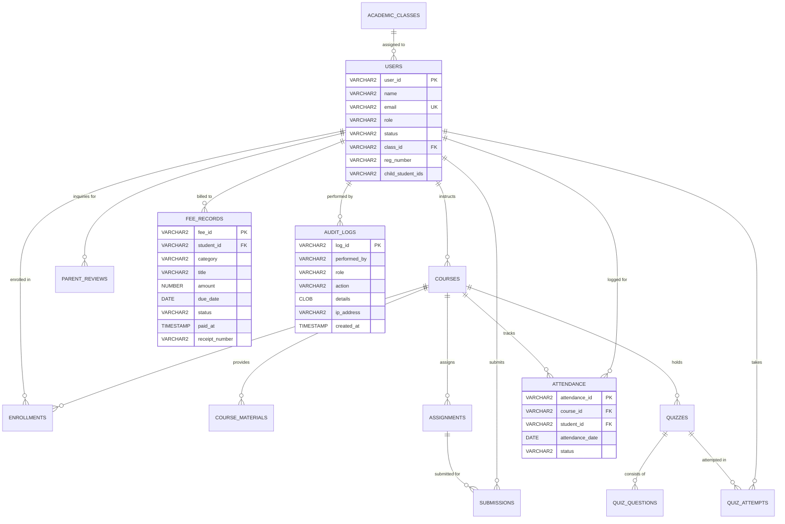

# EduTrack LMS — Comprehensive Enterprise Project Report

**Document Title**: Complete System Specification, Architectural Design & Engineering Report  
**System Name**: EduTrack LMS (Enterprise University Learning Management & Academic Intelligence System)  
**Version**: 3.0.0 (Production Release)  
**Engineering Stack**: React 19, TypeScript, Tailwind CSS v4, Express.js REST API, Oracle Database 19c-23c Enterprise Schema, Vite  
**Repository**: `E:\Projects\Edutrack` / [GitHub: Techmasternikhil/Edutrack](https://github.com/Techmasternikhil/Edutrack.git)  

---

## 1. Executive Summary & Project Overview

**EduTrack LMS** is an enterprise-grade academic intelligence and learning operations platform developed for higher education institutions, universities, and polytechnic colleges. Designed around statutory academic governance and strict Role-Based Access Control (RBAC), the platform brings together four distinct stakeholder personas: **University Administrators**, **Faculty Members & Class Teachers**, **Students**, and **Parents/Guardians**.

### Core Problems Solved
1. **Statutory Attendance Deficit Blindspots**: Automated tracking of the statutory 75% attendance threshold with proactive warnings and real-time guardian visibility.
2. **Disconnected Institutional Billing & Financial Clearance**: Unified invoicing, student/parent multi-channel fee payment (UPI, Cards, Net Banking), and automated administrative/faculty payment alert dispatches.
3. **Fragmented Academic Onboarding**: Strict two-stage registration pipeline (Class Teacher verification followed by Central Administrative provisioning).
4. **Pedagogical Assessment & Multimedia Learning**: Native YouTube lecture integration, rubric-driven coursework submission/grading, and real-time timed quiz engine with immediate performance analytics.

---

## 2. Multi-Role Use Case Diagram

The following diagram illustrates the complete actor-to-feature mapping across the four institutional user roles:

```mermaid
graph LR
    %% Actors
    Admin([University Administrator])
    Faculty([Faculty / Class Teacher])
    Student([Enrolled Student])
    Parent([Parent / Guardian])

    %% System Boundaries
    subgraph "EduTrack LMS Platform"
        %% Auth & Security
        UC_Auth[1. Authenticate & Session Management]
        UC_RegTwoStage[2. Two-Stage Registration Approval]
        UC_Audit[3. View Tamper-Evident Audit Logs]
        UC_UserManage[4. User Account Provisioning & Status]

        %% Academic Operations
        UC_ClassManage[5. Academic Classes & Teacher Assignment]
        UC_CourseManage[6. Course Allocation & Capacity Management]
        UC_Materials[7. Upload Lecture Materials & YouTube Videos]
        UC_Attendance[8. Session Attendance Marking & Analytics]

        %% Assessments & Coursework
        UC_Assignments[9. Create & Grade Coursework Assignments]
        UC_SubmitWork[10. Submit Assignment Projects & Files]
        UC_Quizzes[11. Author Timed Quizzes & Analytics]
        UC_TakeQuiz[12. Attempt Online Timed Quizzes]

        %% Financial Clearance & Billing
        UC_CreateInvoice[13. Generate Institutional Fee Invoices]
        UC_SendBillingAlert[14. Dispatch Billing Dues Alerts]
        UC_PayFee[15. Settle Semester Fees via UPI/Card]
        UC_DownloadReceipt[16. View & Download Fee Receipts]

        %% Parental Oversight & Communication
        UC_ParentMonitor[17. Non-Intrusive Academic & Attendance Monitoring]
        UC_ParentInquiry[18. Submit & Track Faculty Inquiries]
        UC_FacultyReply[19. Respond to Parent Academic Inquiries]
    end

    %% Actor Connections
    Admin --> UC_Auth
    Admin --> UC_RegTwoStage
    Admin --> UC_Audit
    Admin --> UC_UserManage
    Admin --> UC_ClassManage
    Admin --> UC_CourseManage
    Admin --> UC_CreateInvoice
    Admin --> UC_SendBillingAlert

    Faculty --> UC_Auth
    Faculty --> UC_RegTwoStage
    Faculty --> UC_Materials
    Faculty --> UC_Attendance
    Faculty --> UC_Assignments
    Faculty --> UC_Quizzes
    Faculty --> UC_SendBillingAlert
    Faculty --> UC_FacultyReply

    Student --> UC_Auth
    Student --> UC_Materials
    Student --> UC_SubmitWork
    Student --> UC_TakeQuiz
    Student --> UC_PayFee
    Student --> UC_DownloadReceipt

    Parent --> UC_Auth
    Parent --> UC_ParentMonitor
    Parent --> UC_PayFee
    Parent --> UC_DownloadReceipt
    Parent --> UC_ParentInquiry
```

---

## 3. Comprehensive Feature Breakdown by Stakeholder

### 3.1. University Administrator Persona
- **Institutional Governance Dashboard**: Overview of total enrolled students, faculty count, course load, pending approval queues, and gross fee collections.
- **Two-Stage Registration Authority**: Final approval queue for students and parents who have passed class teacher verification; direct approval queue for faculty applicants.
- **Academic Class & Section Management**: Creation of academic classes (e.g., *B.Tech Computer Science — Semester 4 (Section A)*), assignment of designated Class Teachers, and tracking student class enrollments.
- **Curriculum & Course Management**: Course creation with assigned department, credits, semester, student capacity limits, and faculty allocation.
- **Institutional Billing Engine**: Generation of student invoices for Tuition, Lab/Exam fees, Library, Hostel, Transport, and Sports.
- **Fee Dues & Defaulter Alerting**: Real-time filtering of pending and overdue invoices, with one-click dispatch of multi-channel billing alerts to both students and parents.
- **Security Audit Logs**: Immutable log tracking every administrative action, user login, fee payment, and account state mutation with timestamps and IP addresses.

### 3.2. Faculty & Class Teacher Persona
- **Subject Courseware Management**: Creation and publication of lecture notes, PDF guides, presentations, and external research links organized by academic module/unit.
- **Native YouTube Video Player**: Direct embedding of YouTube lecture videos with thumbnail preview, video duration, module assignment, and external link handling.
- **Session Attendance Register**: Date-based attendance marking (`PRESENT`, `ABSENT`, `LATE`) with instant statutory percentage calculation and automatic flagging of students under the 75% statutory compliance threshold.
- **Coursework & Rubric Grading**: Creation of assignments with due dates and maximum marks; evaluation of student file submissions with marks and constructive feedback.
- **Interactive Quiz Authoring & Analytics**: Creation of multiple-choice timed quizzes with randomized options, instant evaluation, and score analytics across all enrolled students.
- **Class Teacher Approval Gateway**: Verification of student registration numbers and guardian relationships for applicants belonging to the teacher's assigned class.
- **Guardian Inquiry Resolution**: Direct communication channel to review and respond to parent inquiries regarding student performance and attendance.

### 3.3. Enrolled Student Persona
- **Student Academic Dashboard**: Real-time visibility into cumulative GPA, overall attendance compliance percentage, pending coursework deadlines, and active quizzes.
- **Subject-Wise Live & Historical Attendance Monitoring**: Dedicated **My Attendance** dashboard providing overall attendance percentage, statutory compliance badge (`COMPLIANT` vs `WARNING`), present/late/absent session counts, subject-wise attendance breakdown table with shortage counts (consecutive classes needed to reach 75%), recent live submissions from instructors, and complete date/subject/status filterable attendance ledger.
- **Multimedia Learning Portal**: Access to course materials, downloadable PDFs, and responsive embedded YouTube lecture streams.
- **Assignment Submission Engine**: File upload interface for submitting project files and coursework before deadlines.
- **Timed Online Quiz Engine**: Interactive assessment mode with countdown timer, question progression, and instant score computation with detailed solution reviews.
- **Fee Payment & Invoicing Hub**: Detailed view of all semester billings with status tags (`PAID`, `PENDING`, `OVERDUE`); integrated mock payment gateway supporting UPI (VPA) and Debit/Credit Cards; instantaneous receipt generation.

### 3.4. Parent / Guardian Persona
- **Multi-Child Academic Oversight**: Isolated portal strictly restricted to the parent's authorized wards via `childStudentIds`.
- **Child Subject-Wise Live & Historical Attendance Monitoring**: Dedicated **Child Attendance** dashboard mirroring the student's metrics in real time; provides subject-wise breakdown, visual session distribution charts (Present, Late, Absent), recent live faculty submissions, interactive history ledger with date/subject/status filters, and automatic statutory shortage warnings when attendance dips below 75%.
- **Academic Performance & Marks Visualizer**: Coursework assignment grades and quiz scores rendered as comparative bar charts.
- **Direct Ward Fee Settlement**: Full access to the student billing section allowing parents to settle outstanding college dues and download official tax receipts.
- **Faculty Inquiry Channel**: Direct messaging to course instructors and class teachers categorized by `ACADEMIC_CONCERN`, `ATTENDANCE`, `APPRECIATION`, or `GENERAL`.

---

## 4. End-to-End System Workflows

### 4.1. Two-Stage User Onboarding Workflow

---

### 4.2. Invoicing, Billing Alert, and Fee Payment Workflow

---

### 4.3. Live & Historical Attendance Pipeline & Academic Calculation Engine

---

## 5. Relational Data Architecture (Oracle Database Schema)

The platform is backed by an enterprise-grade Oracle Database 19c/21c/23c schema specification (`backend/oracle-schema.sql`):

---

## 6. Security, Isolation, and Compliance Architecture

1. **Role-Based Isolation (RBAC)**: All UI routes, view triggers, and backend controllers validate caller role identity. Students and parents cannot query instructor evaluation queues, staff rosters, or administrative audit logs.
2. **Guardian Data Segregation**: Parents can access *only* the specific student records linked to their account via `childStudentIds`. All Recharts visual metrics, submission logs, and attendance percentages are filtered before rendering.
3. **Statutory Threshold Governance**: Constant `APP_CONFIG.ATTENDANCE_STATUTORY_THRESHOLD = 75%` is enforced uniformly across frontend dashboards and backend analytics via [`src/utils/academic.ts`](file:///e:/Projects/Edutrack/src/utils/academic.ts).
4. **Tamper-Evident Audit Logging**: System operations (user login, registration status modification, invoice creation, fee payment, and grade entry) record immutable entries in `auditLogsStore`.

---

## 7. Verification & Production Build Status

- **Static Type Checking**: `npx tsc --noEmit` passes with **0 errors**.
- **Production Asset Compilation**: `npm run build` compiles clean production artifacts via Vite and bundles `server.ts` into `dist/server.cjs` via esbuild.
- **E2E Tested Core Flows**:
  - Two-stage registration approval (Applicant -> Class Teacher -> Admin -> Verified Login).
  - Admin invoice generation and multi-channel billing dues reminders.
  - Student and Parent fee payment via UPI / Card with instant receipt generation.
  - Session attendance marking with statutory threshold warnings (<75%).
  - YouTube lecture streaming and timed quiz evaluation.
  - Multi-faculty assignment for combined Theory + Practical subjects (`PSP(T+P)`, `OS(T+P)`).
  - Dynamic faculty course access and backend 403 Forbidden verification for unassigned courses.

---

## 8. Official Academic Context & Timetable Matrix (AY 2026–2027)

### Academic Metadata
- **Academic Year**: 2026–2027
- **Semester**: IV (ODD)
- **Section**: Section VII / VII-A
- **Department & Program**: Computer Science and Engineering (CSE)
- **Faculty Advisor**: Dr. R. Elankavi
- **Effective From**: 01-07-2026

### Prescribed Curriculum & Faculty Mapping

| Code | Mnemonic | Subject Title | Credits | Subject Type | Allocated Faculty | Room |
|---|---|---|:---:|---|---|---|
| `34421109` | **CNS** | Cryptography and Network Security | 3 | Theory | HCL Trainer | TBC101 |
| `35021C13` | **SE** | Software Engineering | 3 | Theory | Dr. N. Sarika | TBC101 |
| `35021C12` | **PSP(T+P)** | Problem Solving Using Python Programming | 4 | Theory + Practical | Dr. R. Elankavi, Dr. R. Shobana | NEC LAB |
| `35021P13` | **DL** | Deep Learning | 3 | Theory | HCL Trainer | TBC101 |
| `35021C19` | **OS(T+P)** | Operating System Theory and Practical | 4 | Theory + Practical | Mrs. Gayathri, Dr. M. Rajesh | IOT LAB |
| `34421002` | **IR** | Industrial Robotics | 3 | Theory | Mr. Saravanan | TBC101 |
| `35021M81` | **MINI PRO** | Mini Project | 3 | Project | Dr. N. Sarika | INTEL LAB |
| *—* | **SEM** | Seminar | 0 | Seminar | Dr. R. Elankavi | TBC101 |
| *—* | **MENTOR** | Mentor | 0 | Mentoring | Respective Mentor | TBC101 |
| `21SEMNR` | **CC/ECC** | Curricular/Extra-Curricular | 0 | Extra-Curricular | *Unassigned* | TBC101 |

### Weekly Master Timetable (30 Periods / 6 Periods Daily)

| Day | Period 1 | Period 2 | Period 3 | Period 4 | Period 5 | Period 6 |
|---|---|---|---|---|---|---|
| **Monday** | DL | CC/ECC | CC/ECC | PSP(T) | OS(T) | CNS |
| **Tuesday** | DL | PSP(T) | OS(T) | CNS | MINI PRO | MINI PRO |
| **Wednesday** | IR | OS(T) | OS(P) | PSP(P) | DL | SE |
| **Thursday** | CNS | SE | IR | PSP(T) | IR | SEM |
| **Friday** | PSP(P) | PSP(P) | MINI PRO | MINI PRO | SE | MENTOR |

*Statutory Breaks Preserved: Interval (10:40 AM – 10:50 AM), Lunch (11:50 AM – 12:30 PM), Afternoon Interval (2:25 PM – 2:35 PM).*

### Student & Parent Cohort Roster (Section VII-A)

All 10 enrolled students and their corresponding legal parents/guardians are fully configured with authentic Indian naming, isolated parent-student relationship keys (`childStudentIds`), GPA scores, and academic fee ledger profiles.

| # | Student Name | Reg Number | Student Login Email | Parent / Guardian | Parent Login Email | GPA | Fee Status |
|---|---|---|---|---|---|:---:|:---:|
| 1 | **Aarav Sharma** | `CS-2024-041` | `aarav.sharma@student.edutrack.edu` | **Raveendra Sharma** | `raveendra.sharma@gmail.com` | 3.82 | PAID |
| 2 | **Diya Patel** | `CS-2024-042` | `diya.patel@student.edutrack.edu` | **Suresh Patel** | `suresh.patel@gmail.com` | 3.91 | PENDING |
| 3 | **Rohan Iyer** | `CS-2024-043` | `rohan.iyer@student.edutrack.edu` | **Subramanian Iyer** | `subramanian.iyer@gmail.com` | 3.78 | OVERDUE |
| 4 | **Ananya Deshmukh** | `CS-2024-044` | `ananya.deshmukh@student.edutrack.edu` | **Rajesh Deshmukh** | `rajesh.deshmukh@gmail.com` | 3.88 | PAID |
| 5 | **Aditya Verma** | `CS-2024-045` | `aditya.verma@student.edutrack.edu` | **Manoj Verma** | `manoj.verma@gmail.com` | 3.65 | PAID |
| 6 | **Pooja Sundaram** | `CS-2024-046` | `pooja.sundaram@student.edutrack.edu` | **Gopal Sundaram** | `gopal.sundaram@gmail.com` | 3.95 | PAID |
| 7 | **Karthik Raman** | `CS-2024-047` | `karthik.raman@student.edutrack.edu` | **Venkatesh Raman** | `venkatesh.raman@gmail.com` | 3.72 | PENDING |
| 8 | **Sneha Kulkarni** | `CS-2024-048` | `sneha.kulkarni@student.edutrack.edu` | **Anand Kulkarni** | `anand.kulkarni@gmail.com` | 3.84 | PAID |
| 9 | **Vikram Choudhury** | `CS-2024-049` | `vikram.choudhury@student.edutrack.edu` | **Debashis Choudhury** | `debashis.choudhury@gmail.com` | 3.59 | OVERDUE |
| 10 | **Meera Nair** | `CS-2024-050` | `meera.nair@student.edutrack.edu` | **Balachandran Nair** | `balachandran.nair@gmail.com` | 3.92 | PAID |

*All student and parent accounts use the default demonstration security credentials (`password123`).*

